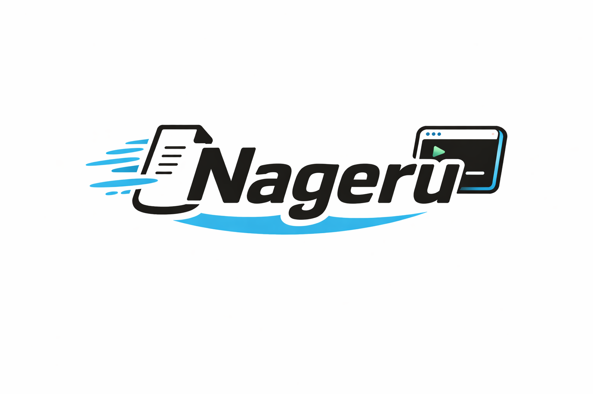

<h1 align="center">
  
</h1>

<p align="center">
  VS Code からファイルコンテキストを AI CLI ツールに投げる
</p>

<p align="center">
  <a href="./README.md">English</a> | 日本語
</p>

**Nageru** は、VS Code エディタで選択した行範囲をフォーマットして AI CLI ツール（Claude Code / Codex CLI）のターミナル入力欄に配置する VS Code 拡張機能です。コードを選んで、AI に投げる。

## クイックスタート

1. `.vsix` ファイルを VS Code にインストール
2. エディタでコードの行を選択
3. `Cmd+Shift+;` (Mac) / `Ctrl+Shift+;` を押す
4. フォーマット済みのコンテキストがターミナル入力欄に配置される

## コマンド

| コマンド | 説明 | キーバインド |
|---------|------|------------|
| `Nageru: Send File Context to Terminal` | ターミナルに送信 + クリップボードにコピー | `Cmd+Shift+;` (Mac) / `Ctrl+Shift+;` |
| `Nageru: Copy File Context to Clipboard` | クリップボードにコピーのみ | - |

右クリックメニューからも実行できます。

## フォーマット例

| 設定 | 出力例 |
|------|--------|
| `claude-code` | `@src/index.ts#L15-L23` |
| `codex` | `src/index.ts:15-23` |
| `custom` | ユーザー定義テンプレート |

## 設定

| 設定キー | 型 | デフォルト | 説明 |
|---------|-----|----------|------|
| `nageru.format` | enum | `claude-code` | フォーマット種類 (`claude-code` / `codex` / `custom`) |
| `nageru.customFormat` | string | `${filePath}:${startLine}-${endLine}` | カスタムテンプレート |
| `nageru.pathType` | enum | `relative` | `relative` (相対パス) / `absolute` (絶対パス) |
| `nageru.sendMethod` | enum | `both` | `both` / `clipboard` / `terminal` |
| `nageru.focusTerminal` | boolean | `true` | 送信後にターミナルへフォーカスを移動 |
| `nageru.appendSpace` | boolean | `true` | 送信テキストの末尾にスペースを付加 |

プライバシー面では `relative` がより安全です。`absolute` に切り替えると、生成されるコンテキストにローカルのユーザー名やホームディレクトリなどのパス情報が含まれる可能性があります。

## 開発

```bash
pnpm install
pnpm run compile
# F5 で Extension Development Host を起動
```

## VSIX の生成とインストール

```bash
pnpm run geni
```

## ライセンス

MIT
